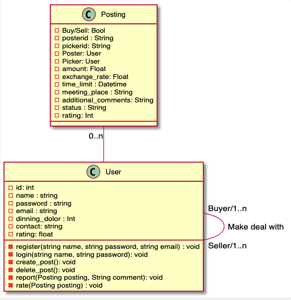
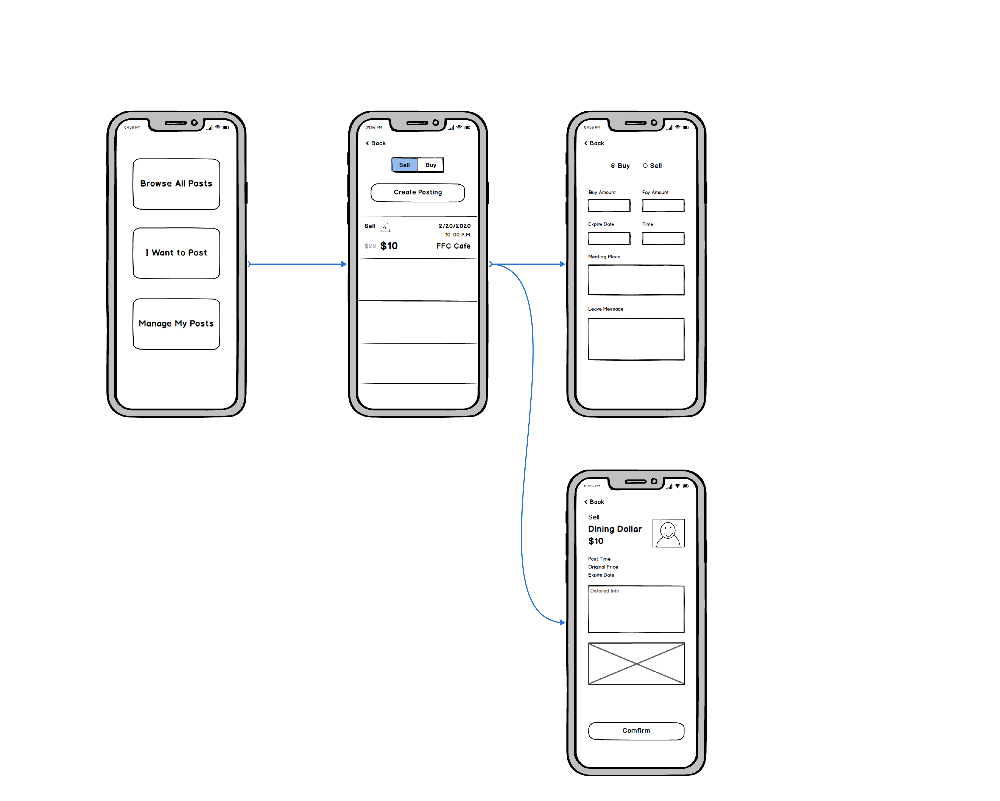

# Design and Planning

## OO Design

> A UML class diagram reflecting the "model" for that iteration only.
> Use a software to draw this (e.g. draw.io) and save the diagram as an image.
> Upload the image and link it in here using this syntax

<!-- http://www.plantuml.com/plantuml/uml/SyfFKj2rKt3CoKnELR1Io4ZDoSa70000 -->
<!-- https://plantuml.com/class-diagram -->

## Wireframe

> One (or a few) simple sketch of how the user interacts with the application.
> This could be a sketch of your user interface.
> You can draw it with hand and insert it here as an image.

<!-- https://plantuml.com/sequence-diagram -->

<!-- https://www.jianshu.com/p/a052f82cc18d -->

## Iteration Backlog

> List the User Stories that you will implement in this iteration.

- As someone using the app, I would like to be able to view basic information about other people on the app so that I would be more informed about people I'm dealing with.
- As someone with Dining Dollars, I would want to be able to advertise my service of being willing to buy and resell items for cash, so that people know I am willing to provide my service.
- As someone using the app, I would like to be able to communicate with specific other users on the app, so that we can work out a deal for a transaction or give each other pertinent information.
- As someone using the app, I would like to be able to see a trustworthiness rating for specific other users on the app, so I would be more informed about who I am dealing with.

<!-- User profiles
Posting board
chat
Transaction verification and rating -->

## Tasks

> A tentative list of the "to do" in order to successfully complete this iteration.
> This list will change and it is good to keep it updated.
> It does not need to be exhaustive.

- modal for Transaction class
- modal for User class
- modal for Post class
- Backend base framework init
- database connection with spring boot backend
- POST request handling for new transactions
- GET request handling for getting a list of posts
- GET request handling for getting a user's profile
- POST request handling for new user's profile
- POST request handling for updating user's profile
- POST request handling for new post
- DELETE request handling for taking down post
- Front end form for registering user
- Front end for viewing profiles
- Front end form for new post
- Front end for browsing posts
- POST request handling for new rating submissions for users
- Authentication token given at login and used for further actions
