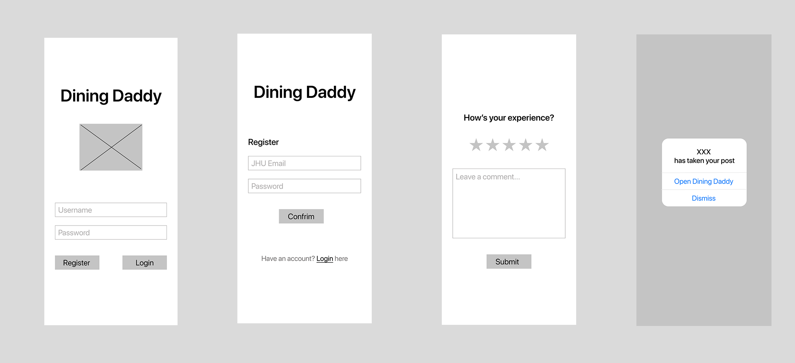

# Design and Planning

## OO Design

> A UML class diagram reflecting the "model" for that iteration only.
> Use a software to draw this (e.g.draw.io) and save the diagram as an image.
> Upload the image and link it in here using this syntax

<!-- http://www.plantuml.com/plantuml/uml/SyfFKj2rKt3CoKnELR1Io4ZDoSa70000 -->
<!-- https://plantuml.com/class-diagram -->

## Wireframe

> One (or a few) simple sketch of how the user interacts with the application.
> This could be a sketch of your user interface.
> You can draw it with hand and insert it here as an image.

<!-- https://plantuml.com/sequence-diagram -->

<!-- https://www.jianshu.com/p/a052f82cc18d -->

## Iteration Backlog

> List the User Stories that you will implement in this iteration.

* As someone using the app, I would like to be able to register and sign in using my JHU email so that I know everyone on the app is part of the JHU community.
* As someone using the app, I would like to be able to communicate with specific other users on the app, so that we can work out a deal for a transaction or give each other pertinent information.
* As someone using the app, I would like to be able to see a trustworthiness rating for specific other users on the app, so I would be more informed about who I am dealing with.
* As a freshman selling dining dollars, I would like to get notified when someone wish to contact me to buy my dining dollars so that I am able to sell whenever there is an opportunity.
* As a buying of dining dollars, I would like to be able to contact someone that is selling dining dollars so I can quickly buy anything I need.
* As someone who has accepted a transaction, I would like to be able to rate the trustworthiness of user on the other end of the transaction, so they would be incentivized to act honestly.
* As someone who has accepted a transaction, I would like to be able to report the user on the other end of the transaction should they make some aggregious offense, so they would be incentivized to act honestly, and to keep the community safe and honest.

<!-- User profiles
Posting board
chat
Transaction verification and rating -->

## Tasks

> A tentative list of the "to do" in order to successfully complete this iteration.
> This list will change and it is good to keep it updated.
> It does not need to be exhaustive.

### Backend

* Authentication token given at login and used for further actions
* Authentication service class for handling auth.
* Authentication layering for all secure requests.
* verification of email when register/login
* POST request of user comment
* GET request of user comment
* Figure out how to use push notification third party services.

### Frontend

* async push IOS notification when post being taken
* specific user profile including rating, posts, comments
* user rating screen for one finished transaction
* register screen using email and password
* transaction history page

## Retrospective of Iteration 1

> The retrospective is an opportunity for your team to inspect itself and create a plan for improvements to be enacted during the next iteration. Review what you had done in iteration 1; note things that you have and have not delivered, note the challenges you had, and reflect on how you shall proceed in the next iteration to do a better job.

### 1.what had done

#### back-end

1. Support for registering new users
2. Support for submitting new ratings for existing users.
3. Support for posting posts, editing posts, and taking down posts.
4. Entity models for users and postings.
5. Database CRUD operations for user and posting models.
6. API end points for getting post lists, users, lists by users, etc.

#### front-end

1. Screens for user login, browsing all user posts, query a post's details, query specific user's posts
2. Able to read user's input or actions and save into parameters
3. Supporting HTTP requests for user login, get all user's posts, delete post, post new posts
4. Bottom screen navigation bar, navigation logic between posts screen and post detail with parameter passing

### 2. Still need to deliver

1. Login logic need to be refined as "first login, then able to see entire interface", (For now they both exists at same navigation stack)
2. user registration (For now we use postman for making new user's data instead)

### 3.challenges encountered

#### back-end

1. Our group needed to learn the Spring Boot framework from scratch, and conflicting or inconsistent online tutorials led to some confusion as to what is actually the correct way to write things.
2. lack of communication between backend members led to delays in implementing key features, which further led to a slow down of development in frontend too.
3. Figuring out how to parse request body and return response body in json took some time.

#### front-end: React native

1. Our group don't have much experience on JavasCript, syntax troubled us a lot.
2. React native is a entirely new framework for all group members, it took us a very long time to learn how it works
3. The logic of how React native navigate in a stack was hard for us, since migrating tutorial code did not work as we expected.
4. Figuring out how to pass parameters between screens is one of our milestones.
5. Making HTTP requests in function and class have quite different structure, that was a challenge for us to handle different async cases properly.

### 4.iteration2's plan

#### back-end

1. We are able to add tokens to verify the idendity of users in order to solve security issues.
2. Adding push notification support.
3. Adding additional user info fields as well as comments for ratings.
4. Adding additional API endpoints as needed.

#### front-end

1. For users who can not login to the application, he will be unable to see detailed posts, we need to polish up the logic of apps.
2. Notifications of person's new posting get accepted,Press the notification and the screen will jump to the application.

