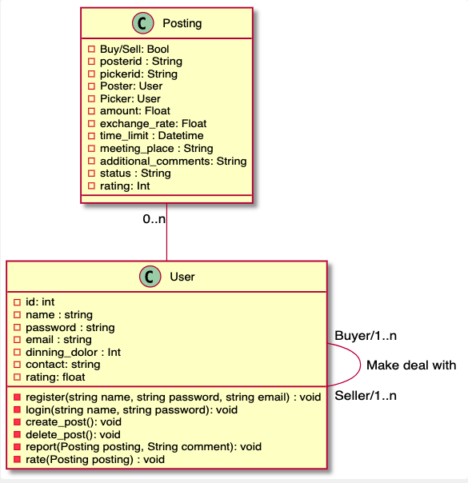

# Design and Planning

## OO Design

> A UML class diagram reflecting the "model" for that iteration only.
> Use a software to draw this (e.g.draw.io) and save the diagram as an image.
> Upload the image and link it in here using this syntax

<!-- http://www.plantuml.com/plantuml/uml/SyfFKj2rKt3CoKnELR1Io4ZDoSa70000 -->
<!-- https://plantuml.com/class-diagram -->

## Wireframe

> One (or a few) simple sketch of how the user interacts with the application.
> This could be a sketch of your user interface.
> You can draw it with hand and insert it here as an image.

<!-- https://plantuml.com/sequence-diagram -->

<!-- https://www.jianshu.com/p/a052f82cc18d -->

## Iteration Backlog

> List the User Stories that you will implement in this iteration.

* As a junior buying items from charles market, I would like to see how many people are currently available for contact near charles market so that I am able to quickly buy anything I need.
* As a freshman selling dining dollars, I would like to get notified when someone wish to contact me to buy my dining dollars so that I am able to sell whenever there is an opportunity.
* As someone in a transaction, it would be nice to be able to see the location of the other person on a map, so we don't have to both be in the same place necessarily at the moment of purchase using Dining Dollars.

## Tasks

> A tentative list of the "to do" in order to successfully complete this iteration.
> This list will change and it is good to keep it updated.
> It does not need to be exhaustive.

### Backend

* Auction System (ambitious goal)
* Authentication token given at login and used for further actions
* Authentication service class for handling auth.
* Authentication layering for all secure requests.
* verification of email when register/login
* POST request of user comment
* GET request of user comment
* Figure out how to use push notification third party services.

### Frontend

* async push IOS notification when post being taken
* Map view for the users of ongoing transactions that can display the other user's location, transaction detail and user profiles.
* A secure chat channel for buyers and sellers to communicate
* Display use's postings of different status in distinguish tab view with corresponding functional operations like cancel, pick, chat and comment.
* Logout functionality

## Retrospective of Iteration 2

> The retrospective is an opportunity for your team to inspect itself and create a plan for improvements to be enacted during the next iteration. Review what you had done in iteration 1; note things that you have and have not delivered, note the challenges you had, and reflect on how you shall proceed in the next iteration to do a better job.

### 1.what had done

#### back-end

1. Authentication support (JWT filter and token)
2. Partial notification support
3. Additional API endpoints for front end requests

#### front-end

1. Screens for user profile that can display ratings, postings, and comments.
2. A complete authentic flow for user to register, authentic self using secret token (stored in async store that works both on IOS and Andriod), make auth related HTTP requests and navigation logic behind all auth related operations.
3. Nice and beautiful UI designs for user auth pages.

### 2. Still need to deliver

1. The basic operations of IOS notification flow is settled, but need specific code for different type of notifications
2. Notification integration between front and back end.

### 3.challenges encountered

#### back-end

1. Notification is harder than expected.
2. Unforeseen circumstances in real life caught team unprepared and messed up meeting schedule.
3. Vague tasks impede speedy development.

#### front-end: React native

1. React native UI design requires a lot experiments for us, since we don't have much experience on this.
2. Learn how to implement React native notification, we tried different plans and failed several times, finding our current lacked a lot configurations to be compilable for IOS, but we finally choose and learned to use expo APIs.
3. Using appropriate async store structure requires the comprehension of React Hooks and Redux, which is really time consuming to learn.

### 4.iteration2's plan

#### back-end

1. Complete notification integration with frontend
2. Map support, along with location data (Geohash) and API endpoints
3. Chat support, along with chat history storage and real-time chat support.

#### front-end

1. Correctly handle different notification calls from backend that is compatible with IOS platform
2. A responsive map view for users to share live locations with attached transaction details.
3. A secure chat channel between two users that keeps user's chat history and supports real-time communication

